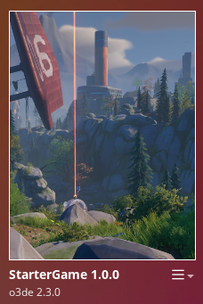

<u>Supported o3de versions</u> : **24.09**

# Starter Game : Port to O3DE of the lumberyard project

<video autoplay loop src="doc/demo.mp4">Demo</video> 

This project aims to port to O3DE the ["Starter Game"](https://aws.amazon.com/blogs/gametech/now-available-starter-game/) project. It can be used to stress test the features of O3DE and see how they compare utility-wise and performance-wise with Lumberyard.

It was originally developped by AWS in collaboration with [Climax studio](http://www.climaxstudios.com/) for the [Lumberyard Engine](https://aws.amazon.com/lumberyard/) and showcased during the GDC 2017. This project contains a large map with vegetation and water, interactive elements, scripts, animations, a combat system, AI scattered around the map and a UI with objective marker.

The goal is to port and adapt all of these features to be as close as possible to the Lumberyard project. You can check the current state of the port by browsing below.

## Prerequisites

You need to build or [install O3DE engine](https://o3de.org/download/).

You need to [install git with lfs support](https://git-scm.com/downloads), and [setup a token on your github account](https://www.docs.o3de.org/docs/welcome-guide/setup/setup-from-github/#configure-credentials-for-git-lfs). Needed as the repository uses Git LFS, the "Download ZIP" button will not download assets.

## How to run

1. Clone the github repository (`git clone https://github.com/o3de/startergame-assets.git`). When prompted to authenticate, use your github username and the token as password.
2. Launch O3DE. It will open the Project manager. Click on the **New Project** button then **Open Existing Project** option.
3. Navigate to the cloned repository. Open the `Project` folder. The project should now be registered.
4. Click on the **Build Project** button, located on the **Starter Game** image.

5. Once the project has been built successfully, use the **Open Editor** button.
6. The asset pre-processor will run for a bit. Once it is over you will be welcomed with the **Open a Level** window. Pick the first one.

### Initial setup

Upon opening the level for the first time, the viewport will look empty. This is because the map is not located at the default camera position. Simply right click in the "entity outliner" on an entity to "Find Selected Entities in Viewport". The camera will travel there and you will be able to look at the map.

The map being quite big, you will likely want to increase the camera far plane. To do so, go to "Edit/Editor Settings/Global Preferences" top menu, and under "Viewport" set the "Perspective Far Plane" from 100 to 1500. 

## How to contribute ?

You can follow [this documentation](https://development--o3deorg.netlify.app/docs/learning-guide/tutorials/lumberyard-to-o3de/) to understand how to launch the starter game project on Lumberyard. This will be needed to compare the feature and behavior between the original game and the port. 

As many assets were not converted yet, they can either be created from scratch or converted using an improved version of the conversion scripts. To simplify the maintenance, we try to match as close as possible the file layout used by the original projects (most content placed in the gems, prefabs still using slice folders).

Some files are using git lfs, you can modify them but in order to push your changes, even on a fork, you need to be a contributor of this project.

### What is the current state of the port ?

- [x] Terrain layout
- [x] Objects placed at the correct positions
- [x] Import most of the materials
- [ ] Skybox
- [ ] Lighting
- [ ] Animated water
- [ ] Particles (birds, water splash)
- [ ] Audio
- [ ] Vegetation (grass)
- [ ] User Interface (quest marker, life, main menu)
- [ ] Character movement (walk, jump, attack)
- [ ] Weapons
- [ ] AI wandering and attacking
- [ ] Level scripting of interactive elements (doors)

## License

For terms please see the LICENSE*.TXT file at the root of this distribution.
