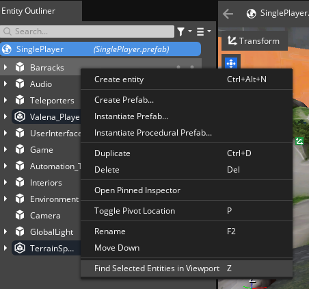

<u>Supported o3de versions</u> : **24.09**

# Starter Game : Port to O3DE of the lumberyard project

## Prerequisites

You need to build or [install O3DE engine](https://o3de.org/download/).

You need to [install git with lfs support](https://git-scm.com/downloads), and [setup a token on your github account](https://www.docs.o3de.org/docs/welcome-guide/setup/setup-from-github/#configure-credentials-for-git-lfs). Needed as the repository uses Git LFS, the "Download ZIP" button will not download assets.

## How to run

1. Clone the github repository (`git clone https://github.com/o3de/startergame-assets.git`). When prompted to authenticate, use your github username and the token as password.
2. Launch O3DE. It will open the Project manager. Click on the **New Project** button then **Open Existing Project** option.
3. Navigate to the cloned repository. Open the `Project` folder. The project should now be registered.
4. Click on the **Build Project** button, located on the **Starter Game** image.

5. Once the project has been built successfully, use the **Open Editor** button.
6. The asset pre-processor will run for a bit. Once it is over you will be welcomed with the **Open a Level** window. Pick the first one.

## Initial setup

Upon opening the level for the first time, the viewport will look empty. This is because the map is not located at the default camera position. Simply right click in the "entity outliner" on an entity to "Find Selected Entities in Viewport". The camera will travel there and you will be able to look at the map.

The map being quite big, you will likely want to increase the camera far plane. To do so, go to "Edit/Editor Settings/Global Preferences" top menu, and under "Viewport" set the "Perspective Far Plane" from 100 to 1500. 

## How to contribute

You can follow [this documentation](https://development--o3deorg.netlify.app/docs/learning-guide/tutorials/lumberyard-to-o3de/) to understand how to launch the starter game project on Lumberyard engine. Many assets were not converted yet, they can either be created from scratch or converted using an improved version of the conversion scripts.

## License

For terms please see the LICENSE*.TXT file at the root of this distribution.
